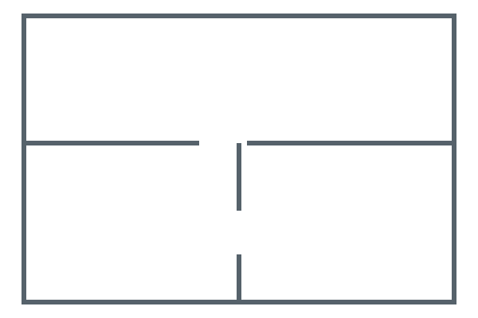

# Floorplan Card

A Home Assistant dashboard card for furnishing your floorplan, placing lights and sensors, selecting lights individually or as a group, and seeing room lighting and presence at a glance. The same editable layout supports clean 2D, two pixel-art styles and furnished 3D.



The example above is fictional. Personal floorplans remain in your own Home Assistant configuration.

## Install locally

1. Copy `dist/hacs-floorplan.js` to Home Assistant's `/config/www/hacs-floorplan.js`.
2. In **Settings → Dashboards → Resources**, add `/local/hacs-floorplan.js` as a **JavaScript module**. Advanced mode may be needed to show Resources.
3. Reload the browser, edit your dashboard, select **Add card**, and search for **Floorplan Card**.
4. Follow the visual editor and press Home Assistant's **Save** button when finished. No YAML configuration is required.

## Install through HACS

Add `https://github.com/ShiftySushi/hacs-floorplan` to HACS **Custom repositories** with type **Dashboard**. Install **Floorplan Card** and reload the browser. If HACS does not register the resource automatically, add `/hacsfiles/hacs-floorplan/hacs-floorplan.js` as a JavaScript module in Dashboard Resources.

The distribution filename matches the repository name. [HACS supports installation from the default branch without a versioned release](https://www.hacs.xyz/docs/publish/plugin/). The GitHub distribution contains only plugin code and the fictional demo; personal floorplans are supplied locally through the editor.

## Guided setup

1. **Floors:** add storeys and choose floorplan images. PNG, JPEG and WebP use Home Assistant's authenticated image upload; small SVG files are embedded in the dashboard configuration. An existing `/local/` or HTTPS image URL is also supported. Rotate by 90° buttons or any angle from 0–359°. Set the full plan's width and depth in metres, including image margins, or mark two points and enter their known distance to calibrate the scale. **Align storeys in 3D** exposes floor elevation and horizontal offsets for matching building corners or stairwells.
2. **Rooms:** click the inside corners of a room in order and finish its polygon. Undo, cancel, redraw and coordinate controls are provided. Choose a floor material and colour, then search for and assign its lights and optional motion/occupancy/presence binary sensors. For 3D, trace each shared wall once, set its height and thickness, then add doors and windows. Opening positions and dimensions remain editable.
3. **Furniture:** choose **Unlock editing**, search the illustrated catalogue, choose an object and tap its location. Drag to move, or drag a selected corner to resize. The selected-object toolbar provides rotation, duplication and removal; right-click focuses these tools. The inspector provides exact dimensions and keyboard alternatives. Lock editing when finished. Optional 10, 25 or 50 cm snapping and keyboard controls help with precise placement. Sofa, piano and bed variants are available. Furniture is decorative and does not need a Home Assistant entity.
4. **Entities:** search for a light, sensor or binary sensor and tap its position. Select a marker to reposition it, or adjust its coordinates. Choose a generic, pendant or spot icon. An existing marker's **Assigned entity** selector replaces its binding while preserving the position and updating matching room/group assignments across floors. This is useful for binding an imported layout's placeholders to real devices. The editor can place assigned room lights automatically for you to fine-tune.
5. **Groups:** create named selections spanning rooms or floors. Choose the floor for new members; unpositioned lights receive individual markers that you can fine-tune in **Entities**.
6. **Review:** choose a render style, furniture visibility, room labels and 3D quality. Check the visual preview for each floor, then press Home Assistant's **Save** button. Reopen any section to make changes; **Undo** and **Redo** cover scene edits while the editor remains open.

The catalogue includes pianos, TVs and TV benches, side tables, display cabinets, bookshelves, sofas, beds, dining tables and chairs, toilets, sinks, baths, showers, desks, office chairs, kitchen units, islands, fridges, rugs, plants, stairs and floor lamps. Images provide a tracing reference; the card does not automatically infer walls or furniture from a photograph or drawing.

## Render styles

**2D** uses subdued furniture and light markers. **Custom** offers **Pokémon**, **Zelda** and **Sims-like** from a dropdown. The two pixel styles use distinct tiled floors, raised walls and furniture designs. Pokémon uses chunky contemporary furniture; Zelda uses timber frames, carved borders and inlaid patterns. The furniture picker previews the selected pixel style. Their bundled pixel artwork is original. Your room boundaries, furniture positions and entity assignments are shared across styles. Floor rotation changes the view without changing those placements.

**Sims-like** is a furnished isometric cutaway with soft toon shading, warm walls, a lawn base and green diamonds above occupied rooms. It bundles 14 selected models from [Kenney’s Furniture Kit](https://kenney.nl/assets/furniture-kit), released under CC0, including beds, chairs, tables, a sofa and bathroom fittings. Models fit within the configured dimensions without stretching. Custom variants and reactive devices use the existing procedural models. All assets are bundled locally; there are no runtime downloads. The source and licence are recorded in `src/assets/kenney-furniture-LICENSE.txt`. This is an original life-simulation presentation, not artwork extracted from The Sims.

In **Review → Use your own Pokémon or Zelda artwork**, upload an aligned background for either custom style on each floor. It replaces the floor and wall artwork; furniture, lights and presence remain interactive overlays. Full configuration exports embed these backgrounds. If you change room or wall geometry, update the supplied background to match.

Select furniture and open **Custom pixel artwork** to upload a transparent sprite for either style. Sprites keep their aspect ratio, position and rotation; upright items can extend beyond their shallow floor footprint. These images are also embedded in configuration exports.

**3D** builds an interactive cutaway from room polygons, walls, openings and furniture. Drag to orbit, use the zoom/reset controls, or focus the canvas and use arrow keys, `+`, `−` and `Home`. With several floors, **All storeys** shows an exploded building view. Lighting responds to assigned entities' power, brightness and colour; enough ambient light remains to navigate an unlit room. This is a real-time stylised view, not a photorealistic architectural render. The card falls back to 2D if WebGL is unavailable or interrupted.

Each assigned light creates a local pool of illumination in every render style. Brightness controls its strength; RGB colour and white temperature tint its zone. Overlapping lights brighten more of the room, while unlit areas stay dim. Pools follow the placed markers and stop at room boundaries. Spots use a narrower footprint than pendants; lights without a marker use the room's centre. These are illustrative light footprints, rather than measured beam angles.

Room status shows **Lit** when any assigned light is on and **Dark** when all assigned lights are known to be off. Missing or unavailable lights produce **Lighting unknown** when none is known to be on. Presence is independent of lighting: any assigned binary sensor being `on` shows presence. Missing sensors produce **Presence unknown**, rather than a false empty-room indication. Room status is available as text as well as colour.

Tap a light, room or light group to turn its lights on or off immediately. A room or group with any available light on switches off; otherwise it switches on. Use its separate **Adjust** button, or enable **Select lights**, for brightness and colour. Selections persist across floor changes; turning selection mode off clears them. Sensor markers open Home Assistant's normal entity detail dialog.

Bind individual bulb entities when each bulb should have its own marker. Create card groups for combinations such as spots and pendants, while room controls cover all assigned room lights. Alternatively, bind a Home Assistant smart-group light entity to control that group as one light. Avoid placing both a smart group and its member bulbs in the same card group. The card sends commands to the entities you choose; Home Assistant handles any hardware grouping.

Furniture supports elevation above the floor, so TVs and monitors can sit on benches and desks. TV light strips and hexagonal wall panels can be linked to a light entity; their illumination follows power, brightness and colour. Computers and ultrawide monitors are available in the furniture catalogue. These bindings and elevations are preserved when exporting or rebinding a placed light.

Select a TV in the furniture editor and choose its **TV media player** entity to show animated decorative scenes when it is on. The screen goes dark when the TV is off; this connection is separate from its light strip. Scenes are generated locally, without streaming media, and use a still image when reduced motion is enabled.

TVs and light strips offer matching 43–85 inch size presets, with 65 inch as the default. Wall panels offer Static, Breathe, Wave and Rainbow effects. Lights fade between states over 600 ms; animations respect reduced-motion settings. In 3D, fixtures sit at ceiling height by default, with an optional mounting height in the light editor. Height also controls the spread and strength of their floor illumination.

Enable **Slow idle rotation (3D)** in Display settings to rotate after eight seconds without interaction, at one revolution every ten minutes. This explicit choice also works with reduced motion enabled; decorative animations remain reduced. Switch it off to stop automatic rotation.

The full floorplan background follows the selected style and daylight. Ambient room brightness uses `sun.sun` elevation, with cloud cover from an available weather entity when supplied. Without the Sun integration, the preview estimates daylight from local time. This is an ambient approximation, not a window-by-window sunlight simulation. For seamless custom artwork, use a transparent exterior background.

In **Rooms**, choose a **Room temperature entity** to show its current temperature as a compact readout on the plan. Add radiators through **Furniture**, then choose each **Radiator heating entity** in its inspector. Thermostats glow red only when reporting active heating; heating switches and activity sensors glow when on. Idle and unavailable devices do not glow. Tap a radiator to open its Home Assistant controls. Temperature and heating bindings are included in private scene exports.

Occupied rooms show a presence icon beside their readout and a highlighted outline. Temperatures below 18°C use a cool tint; above 24°C use a warm tint (Fahrenheit readings are converted for this comparison). Choose **Outdoor temperature entity** in **Floors** to show an outdoor reading to the left of the house. Missing readings are hidden.

Furniture editing snaps placements and moves to a 10 cm grid by default. Drag an item from the catalogue onto the plan, or select it and tap its position. You can turn snapping off in the furniture inspector; that choice remains in effect while editing.

Power works for all available selected lights. Brightness, RGB colour and white temperature appear only for compatible selections, with an eligible count shown. Colour is available for RGB, RGBW, RGBWW, HS and XY colour-capable lights, not plain dimmers or tunable-white-only lights. Temperature is clamped to each light's supported range. Mixed selections apply each setting only to compatible lights. Initial control values represent the first compatible light, not a group average.

## Floorplan assets

Keep personal images, outlines, traced geometry, models and exported dashboard configurations under `floorplans/`. This entire directory is ignored by Git and excluded from exports. These assets are not bundled in `dist/` and are not required to build or install the card.

In the card editor, choose **Floors → Choose floorplan image**, then select a local outline. The image is uploaded to your Home Assistant instance or, for a small SVG, stored directly in your dashboard configuration. There is no need to upload it to GitHub, put it in the plugin directory, or edit YAML. Plugin updates leave those personal assets separate from the installed code.

On a personal checkout, the original images and derived assets can remain under `floorplans/`; the private demo is at `/floorplans/demo.html` and model previews at `/floorplans/models/`. Those local files are intentionally absent from a fresh clone. Back them up separately through your normal private backup process.

In **Entities → Add element**, place lights, temperature and presence markers before connecting Home Assistant. Give each element a name and room, and drag it to position it (10 cm snapping). Unconnected lights can already belong to room and group selections. Later, choose **Assigned entity**: the position, name and room/group references are preserved. Unconnected elements are labelled **Not connected** and cannot send commands. They are included in full configuration exports.

Use **Import / export → Export full configuration** to save the layout with all floors, embedded images, rooms, walls, furniture, lighting and sensor assignments, heating bindings, groups and appearance settings in one JSON file. Images must be accessible to the browser; export refuses unreadable images rather than leaving broken local references. On production, install the same or a newer card version and use **Import configuration JSON** in the same editor section. Review the destination entity IDs and save in Home Assistant. This transfers one complete card configuration; it does not transfer Home Assistant integrations, credentials or live entity states. Nothing needs to be committed to Git. Import replaces the card's scene and can be undone. Keep exported files private: they contain your home layout and entity IDs. Portable exports are limited to 32 MB, with fetched images limited to 8 MB each.

The public demo uses a fictional layout and contains no traced personal room boundaries or dimensions.

## Git remotes and publication checks

`origin` is the primary Gitea repository and `github` is the public HACS repository. Pushes are explicit to each remote; there is no automatic mirror of working-directory files.

```sh
git config core.hooksPath .githooks
git config remote.pushDefault origin
npm run check:public
```

The pre-commit hook checks indexed files, including files force-added past `.gitignore`. The pre-push hook checks every reachable historical blob, so deleting a private file from the latest commit does not make a leaking history acceptable. Only approved source, distribution, documentation, tests and fictional demo paths pass; embedded image payloads are also rejected. These local hooks must be enabled on each clone and can be bypassed, so they complement careful review rather than provide a server-side guarantee.

## Development and preview

Requires Node.js 22+. Three.js is bundled into the card; the installed card does not fetch a renderer or artwork from a CDN. esbuild and Playwright are locked development dependencies. Python 3 serves the interactive local demo.

```sh
npm ci --ignore-scripts
npm run build
npm run check
npm test
node scripts/models.mjs  # regenerate SVG outlines and OBJ models
npm run demo
```

Open `http://127.0.0.1:8124/demo/` for the fictional demo. **Live view** fits the floorplan into the available screen, with compatible lighting controls beside it on wider screens. **Edit layout** opens the layout studio. Simulated presence and service failures are available in the demo toolbar. The optional model command requires private `floorplans/models/geometry.json` and is not part of the plugin build. The demos never connect to a live Home Assistant server. The public demo resets on reload; the optional private house demo saves edits in that browser's local storage. Export a portable scene for a separate backup or transfer to Home Assistant.

The `src/` modules separate light service rules, scene geometry, 2D/3D rendering and guided setup. `scripts/build.mjs` uses esbuild to bundle a single self-contained `dist/hacs-floorplan.js`, including licence notices. The packaging check requires a reproducible build below 900,000 bytes. Run the build after changing source; do not edit the distribution directly.

## References

The [Spatial Lights Card](https://github.com/Mihonarium/hass-spatial-lights-card) is the interaction reference supplied for this project. This implementation is independent and does not import its source. Integration follows Home Assistant's [custom card contract](https://developers.home-assistant.io/docs/frontend/custom-ui/custom-card/), [light capabilities](https://developers.home-assistant.io/docs/core/entity/light/) and [image upload API](https://github.com/home-assistant/frontend/blob/dev/src/data/image_upload.ts).

Live Home Assistant installation, authenticated image upload, HACS delivery and physical-device behaviour still require integration verification.
