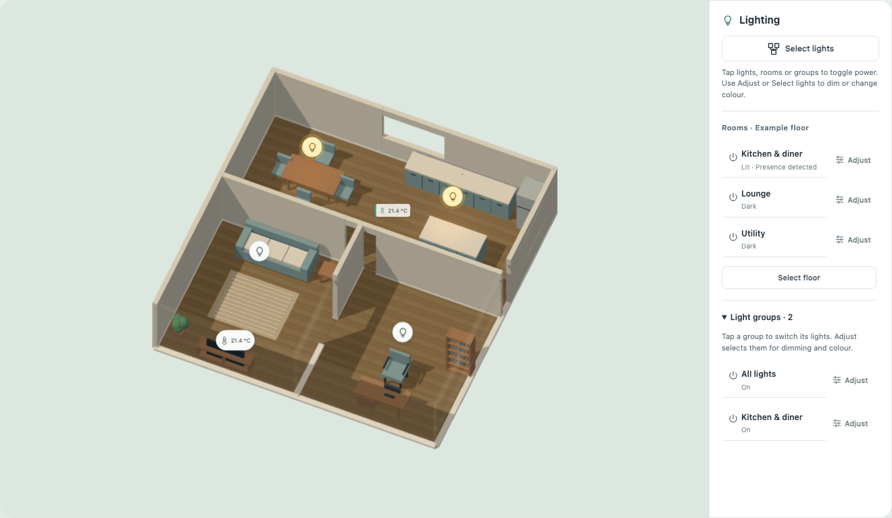

# Floorplan Card

A visual floorplan for your Home Assistant dashboard. Arrange rooms, furniture and controls in the editor, then connect your entities when you’re ready.



*Actual card rendering with a fictional home and simulated entities. Your own floorplan stays in your Home Assistant instance.*

- **Control your home:** toggle individual lights, rooms or groups; see temperature, heating and presence updates.
- **Choose your view:** zoom and rotate in 2D or 3D, or select Pokémon, Zelda and Sims-like styles. Keep controls visible or reveal them on hover.
- **Set up visually:** place elements before linking entities, then export the complete layout and artwork to another installation. No YAML required.

## Install locally

1. Copy `dist/hacs-floorplan.js` to Home Assistant's `/config/www/hacs-floorplan.js`.
2. In **Settings → Dashboards → Resources**, add `/local/hacs-floorplan.js` as a **JavaScript module**. Advanced mode may be needed to show Resources.
3. Reload the browser, edit your dashboard, select **Add card**, and search for **Floorplan Card**.
4. Follow the visual editor and press Home Assistant's **Save** button when finished. No YAML configuration is required.

## Install through HACS

Add `https://github.com/ShiftySushi/hacs-floorplan` to HACS **Custom repositories** with type **Dashboard**. Install **Floorplan Card** and reload the browser. If HACS does not register the resource automatically, add `/hacsfiles/hacs-floorplan/hacs-floorplan.js` as a JavaScript module in Dashboard Resources.

The distribution filename matches the repository name. [HACS supports installation from the default branch without a versioned release](https://www.hacs.xyz/docs/publish/plugin/). The GitHub distribution contains only plugin code and the fictional demo; personal floorplans are supplied locally through the editor.

## Guided setup

1. **Floors:** add storeys and choose floorplan images. PNG, JPEG and WebP use Home Assistant's authenticated image upload; small SVG files are embedded in the dashboard configuration. An existing `/local/` or HTTPS image URL is also supported. Rotate by 90° buttons or any angle from 0–359°. Set the full plan's width and depth in metres, including image margins, or mark two points and enter their known distance to calibrate the scale. **Align storeys in 3D** exposes floor elevation and horizontal offsets for matching building corners or stairwells.
2. **Rooms:** click the inside corners of a room in order and finish its polygon. Undo, cancel, redraw and coordinate controls are provided. Choose a floor material and colour, then search for and assign its lights and optional motion/occupancy/presence binary sensors. For 3D, trace each shared wall once, set its height and thickness, then add doors and windows. Opening positions and dimensions remain editable.
3. **Furniture:** choose **Unlock editing**, search the illustrated catalogue, choose an object and tap its location. Drag to move, or drag a selected corner to resize. The selected-object toolbar provides rotation, duplication and removal; right-click focuses these tools. The inspector provides exact dimensions and keyboard alternatives. Lock editing when finished. Optional 10, 25 or 50 cm snapping and keyboard controls help with precise placement. Sofa, piano and bed variants are available. Furniture is decorative and does not need a Home Assistant entity.
4. **Entities:** search for a light, sensor or binary sensor and tap its position. Select a marker to reposition it, or adjust its coordinates. Choose a generic, pendant or spot icon. An existing marker's **Assigned entity** selector replaces its binding while preserving the position and updating matching room/group assignments across floors. This is useful for binding an imported layout's placeholders to real devices. The editor can place assigned room lights automatically for you to fine-tune.
5. **Groups:** create named selections spanning rooms or floors. Choose the floor for new members; unpositioned lights receive individual markers that you can fine-tune in **Entities**.
6. **Review:** choose a render style, furniture visibility, room labels and 3D quality. Check the visual preview for each floor, then press Home Assistant's **Save** button. Reopen any section to make changes; **Undo** and **Redo** cover scene edits while the editor remains open.

The catalogue includes pianos, TVs and TV benches, side tables, display cabinets, bookshelves, sofas, beds, dining tables and chairs, toilets, sinks, baths, showers, desks, office chairs, kitchen units, islands, fridges, rugs, plants, stairs and floor lamps. Images provide a tracing reference; the card does not automatically infer walls or furniture from a photograph or drawing.

## Render styles

The standalone demo restores simulated device states, brightness, colours and the selected theme when refreshed. A loading screen stays visible until restoration and the initial view are ready. In Home Assistant, device states continue to come from Home Assistant. Blind positions are saved locally per window and shared between 3D views, including the all-storeys view.

In 3D and Sims-like views, click a light fitting to toggle its group. A room-specific configured group takes priority; otherwise matching fittings in the room toggle together, keeping spots, pendants and accent lights separate. If any available member is on, the group turns off. Unavailable and unconnected lights are excluded. The light buttons provide the same keyboard-accessible controls, and dragging the view does not toggle lights.

**2D** uses subdued furniture and light markers. **Custom** offers **Pokémon**, **Zelda** and **Sims-like** from a dropdown. The two pixel styles use distinct tiled floors, raised walls and furniture designs. Pokémon uses chunky contemporary furniture; Zelda uses timber frames, carved borders and inlaid patterns. The furniture picker previews the selected pixel style. Their bundled pixel artwork is original. Your room boundaries, furniture positions and entity assignments are shared across styles. Floor rotation changes the view without changing those placements.

In 3D, open blinds lift into a visible stack; closed blinds cover the window. Click a window or use **Close all blinds / Open all blinds**. Set `blinds: false` on a window opening to omit its blinds. Built-in walls can have `wardrobe_doors: {finish: "mirror", side: 1, count: 4}`; use `"plain"` for regular doors and `side: -1` for the opposite wall face. Mirror panels use a stylised reflective finish. Optional `ceiling_slopes` on a floor render sloping ceiling surfaces and follow the wall cutaway controls. Each slope has a unique `id` and four perimeter `vertices` in `[x_percent, y_percent, height_metres]` order. These fields are preserved by the editor and full configuration export; edit their measurements in the configuration JSON.

**Sims-like** is a furnished isometric cutaway with soft toon shading, warm walls, a lawn base and green diamonds above occupied rooms. It bundles 14 selected models from [Kenney’s Furniture Kit](https://kenney.nl/assets/furniture-kit), released under CC0, including beds, chairs, tables, a sofa and bathroom fittings. Models fit within the configured dimensions without stretching. Custom variants and reactive devices use the existing procedural models. All assets are bundled locally; there are no runtime downloads. The source and licence are recorded in `src/assets/kenney-furniture-LICENSE.txt`. This is an original life-simulation presentation, not artwork extracted from The Sims.

In **Review → Use your own Pokémon or Zelda artwork**, upload an aligned background for either custom style on each floor. It replaces the floor and wall artwork; furniture, lights and presence remain interactive overlays. Full configuration exports embed these backgrounds. If you change room or wall geometry, update the supplied background to match.

Select furniture and open **Custom pixel artwork** to upload a transparent sprite for either style. Sprites keep their aspect ratio, position and rotation; upright items can extend beyond their shallow floor footprint. These images are also embedded in configuration exports.

**3D** builds an interactive cutaway from room polygons, walls, openings and furniture. Drag to orbit, use the zoom/reset controls, or focus the canvas and use arrow keys, `+`, `−` and `Home`. With several floors, **All storeys** shows an exploded building view. Lighting responds to assigned entities' power, brightness and colour; enough ambient light remains to navigate an unlit room. This is a real-time stylised view, not a photorealistic architectural render. The card falls back to 2D if WebGL is unavailable or interrupted.

Each assigned light creates a local pool of illumination in every render style. Brightness controls its strength; RGB colour and white temperature tint its zone. Overlapping lights brighten more of the room, while unlit areas stay dim. Pools follow the placed markers and stop at room boundaries. Spots use a narrower footprint than pendants; lights without a marker use the room's centre. These are illustrative light footprints, rather than measured beam angles.

Room status shows **Lit** when any assigned light is on and **Dark** when all assigned lights are known to be off. Missing or unavailable lights produce **Lighting unknown** when none is known to be on. Presence is independent of lighting: any assigned binary sensor being `on` shows presence. Missing sensors produce **Presence unknown**, rather than a false empty-room indication. Room status is available as text as well as colour.

Tap a light, room or light group to turn its lights on or off immediately. A room or group with any available light on switches off; otherwise it switches on. Use its separate **Adjust** button, or enable **Select lights**, for brightness and colour. Selections persist across floor changes; turning selection mode off clears them. Sensor markers open Home Assistant's normal entity detail dialog.

Bind individual bulb entities when each bulb should have its own marker. Create card groups for combinations such as spots and pendants, while room controls cover all assigned room lights. Alternatively, bind a Home Assistant smart-group light entity to control that group as one light. Avoid placing both a smart group and its member bulbs in the same card group. The card sends commands to the entities you choose; Home Assistant handles any hardware grouping.

Furniture supports elevation above the floor, so TVs and monitors can sit on benches and desks. TV light strips and hexagonal wall panels can be linked to a light entity; their illumination follows power, brightness and colour. Computers and ultrawide monitors are available in the furniture catalogue. These bindings and elevations are preserved when exporting or rebinding a placed light.

Select a TV in the furniture editor and choose its **TV media player** entity to show animated decorative scenes when it is on. The screen goes dark when the TV is off; this connection is separate from its light strip. Scenes are generated locally, without streaming media, and use a still image when reduced motion is enabled.

For a 3D TV slideshow, its scene object can include `tv_scenes`, an array of `{title, image}` entries. Images may be URLs, `/local/` paths or embedded PNG/JPEG/WebP data images. These replace the decorative animation, retain their proportions and cycle every five minutes. Embedded images travel with configuration exports; external URLs must remain accessible and allow cross-origin image loading.

Decorative 3D animations run at up to ten frames per second and pause when the view is hidden. Camera, door, blind and lighting transitions retain a faster update rate. Automatic quality uses up to double-resolution pixels with a 2.5-megapixel budget; High quality removes that pixel budget and Low uses single-resolution pixels. Fixed furniture parts are batched and shadow maps are reused until lighting or opening geometry changes.

In 3D, use the room selector beside the view controls to isolate one room for screenshots. Choose **Whole floor** to restore the surrounding rooms. Isolation fits the camera to the room and trims surrounding walls and sloping ceilings without editing the saved scene. Display settings also offer **Hide light fixtures**, **Hide radiators** and **Hide extraction fans**; hiding a fixture keeps its illumination. These view preferences are saved in the current browser.

Mathmos colour choices list the liquid first and wax second. Both appear in the bottle, and the lamp's spill light blends the two colours while following its light entity's power and brightness.

For a framed display, select **Artwork media player (HA-Meural)** in the furniture editor. The frame follows that entity's `entity_picture`, with an optional fallback image URL or embedded PNG/JPEG/WebP. Remote images must permit browser image access; an unavailable image falls back gracefully. Tap the frame in 3D, or use **Rotate artwork**, to switch portrait/landscape while keeping the artwork upright. This view preference is saved in the browser and does not rotate the physical device. Entity bindings and fallback images are included in scene exports.

TVs and light strips offer matching 43–85 inch size presets, with 65 inch as the default. Wall panels offer Static, Breathe, Wave and Rainbow effects. Lights fade between states over 600 ms; animations respect reduced-motion settings. In 3D, fixtures sit at ceiling height by default, with an optional mounting height in the light editor. Height also controls the spread and strength of their floor illumination.

Enable **Slow idle rotation (3D)** in Display settings to rotate after eight seconds without interaction, at one revolution every ten minutes. Hover over the plan to smoothly return to your last manually chosen view; rotation stays paused until you leave. Dragging or using the camera controls establishes a new view to return to. This explicit choice also works with reduced motion enabled; decorative animations remain reduced. Switch it off to stop automatic rotation.

The full floorplan background follows the selected style and daylight. Ambient room brightness uses `sun.sun` elevation, with cloud cover from an available weather entity when supplied. Without the Sun integration, daylight is calculated from the configured Home Assistant location (or `zone.home`) and date. A clock-only estimate is used only when no location is available. 3D lights illuminate furniture and walls using their brightness and active colour or colour temperature; all rendered lights are blocked by solid walls, while door openings let light through. Detailed furniture shadows and their resolution follow the quality setting. Click a window in 3D to tilt its black wooden blinds open or closed. Closing blinds reduces daylight in the adjoining room without dimming electric lights. Blind positions are visual preview controls for the current view, not Home Assistant cover commands. This is an ambient approximation, not a window-by-window sunlight simulation. For seamless custom artwork, use a transparent exterior background.

In **Rooms**, choose a **Room temperature entity** to show its current temperature as a compact readout on the plan. Add radiators through **Furniture**, then choose each **Radiator heating entity** in its inspector. Thermostats glow red only when reporting active heating; heating switches and activity sensors glow when on. Idle and unavailable devices do not glow. Tap a radiator to open its Home Assistant controls. Temperature and heating bindings are included in private scene exports.

Occupied rooms show a coloured edge on their readout and a highlighted outline. Temperatures below 18°C use a cool tint; above 24°C use a warm tint (Fahrenheit readings are converted for this comparison). Choose **Outdoor temperature entity** in **Floors** to show an outdoor reading to the left of the house. Missing readings are hidden.

Tap or click a room readout to open its status and controls; use **Close** or Escape to dismiss it. **Rooms → Room status, controls and energy** adds humidity beside temperature, PM2.5/VOC readings with configurable warning thresholds, switches, Sleep Mode, media players, scenes, vacuum actions and per-plug power/daily energy. Room readouts put temperature and humidity below the room name. A coloured edge indicates presence; the popup explains presence and air quality. Binary presence sensors cannot determine a person count or position. Unbound energy devices remain editable and totals label missing readings as partial. On narrow screens, collapse **At a glance** if it covers a room marker.

Hovering over a room does not open its popup. Live updates preserve panel scrolling and the expanded or collapsed state of **At a glance**. Room controls stay bound to the selected room, including when two rooms share a name. The popup shows a controls section only when lights or controls are assigned.

A room's **Room heating demand sensor** drives its radiators when no object demand override is set. This is a room-level heating proxy. Printer furniture accepts status, progress, time-left, bed-temperature, job and camera bindings: `printing` animates the nozzle, `error` shows a persistent red warning, and reduced motion stops nozzle movement. The room card groups these readings with the printer light display. Light markers have a minimum 44-pixel invisible target; 3D fittings also accept nearby taps without enlarging their models.

Furniture editing opens in neutral **2D edit**, independently of the live card style. Choose **3D preview** to rotate the model and check heights while editing dimensions in the inspector. Return to 2D to place or drag furniture.

Furniture editing snaps placements and moves to a 10 cm grid by default. Drag an item from the catalogue onto the plan, or select it and tap its position. You can turn snapping off in the furniture inspector; that choice remains in effect while editing.

Search the furniture catalogue by product name for measured presets from Kawai, Oak Furnitureland, LG, IKEA, Secretlab and VASAGLE. Presets include assembled width, depth and height, suggested finish swatches and a dimensions source. KALLAX includes upright and sideways options; the LG G4 includes wall-mounted and freestanding versions. Adjustable desks start at 75 cm high. Dimensions and colours remain editable, and **Restore product dimensions** resets only the size. Product presets use their full physical bounds in 2D and 3D and are preserved in configuration exports. Calibrate the floor dimensions first; finish swatches and model details are illustrative.

Power works for all available selected lights. Brightness, RGB colour and white temperature appear only for compatible selections, with an eligible count shown. Colour is available for RGB, RGBW, RGBWW, HS and XY colour-capable lights, not plain dimmers or tunable-white-only lights. Temperature is clamped to each light's supported range. Mixed selections apply each setting only to compatible lights. Initial control values represent the first compatible light, not a group average.

## At a glance and exterior

**Floors → Outdoor weather** selects a Home Assistant weather entity and controls effect intensity. If left blank, it uses the At a glance weather entity, then an available weather integration. Rain, downpours, snow, sleet, hail, clouds, fog, wind and storms appear outside the building in both 3D styles, including the exterior and all-storey views. Sunny and clear-night conditions use the existing daylight background. Precipitation avoids building footprints; effects pause with the page and respect reduced motion. These are visual weather effects, not a forecast or snow-accumulation simulation. The separate outdoor-temperature chip hides when At a glance already contains weather.

**Lights & sensors → Entity & room labels** creates movable labels for any Home Assistant entity domain. Add a title, associate a room, and combine up to 16 readings. Each row supports a custom name, an optional attribute and a unit override. Drag or enter coordinates to position the label; its height controls the anchor in 3D. Tap a live reading for Home Assistant's normal entity controls. Missing values say “Unavailable”. Labels travel with scene imports and exports.

The furniture catalogue includes **Hue Motion Sensor**, **Everything Presence Pro**, **Everything Presence One** and **Everything Presence Lite**. These are original procedural representations with editable dimensions. Assign presence entities, optionally select a room whose occupancy they report, and choose free placement, a wall/side/offset or a room top corner. Attached models follow geometry edits; detach with **Free placement** before dragging elsewhere. Top-corner placement sets height and points into the room. Model appearance references are in [CREDITS.md](CREDITS.md).

In **Review → At a glance**, enable the translucent information panel, choose a corner, select one to three columns and add or reorder items. Each item supports an icon, accent colour, full-width layout and optional details. Live updates preserve the panel’s scroll position. It stays visible when floorplan markers are hidden and can be collapsed. Calendar items merge the next seven days from selected calendars, sorted by start time with title, time and source. Events refresh through Home Assistant every five minutes while the card is visible; refresh failures retain available events and show a warning. Use **Entity** for pollen, household energy or car battery percentage, and **Plug energy** for a configurable utility/network summary. Selecting a readout opens Home Assistant's entity details.

**Who’s at home**, **HA updates** and **Low batteries** summarise people, update entities and battery-class sensors. They use all matching entities by default, or an explicitly selected list. The low-battery threshold defaults to 20%; unavailable counts are shown by default for explicitly selected lists and can be toggled per item. Automatic summaries omit partial unavailable counts; wholly unavailable readings remain labelled. These readouts do not install updates or control devices. Settings are stored in `information: {enabled, position, columns, items}` and included in scene imports and exports.

For a prepared low-battery summary, select **Battery count sensor** and **Battery names sensor**. These replace the device scan; the names sensor contains comma-separated names. An unavailable summary stays unavailable rather than falling back to a different count.

A scene with `exterior` data exposes an **Exterior** button in 3D. It has its own saved camera; choosing a floor returns to the interior. The exterior contains metre-based `box`, `surface`, `plant` and `car` items: boxes/plants/cars use `x`, `y`, `z`, `width`, `height`, `depth` and optional `rotation`/`colour`; surfaces use three or four `[x,y,z]` vertices. The root specifies `width_m`, `depth_m`, `height_m` and `items`. Exterior geometry is supplied through the scene configuration; the furniture editor does not edit it. Personal site geometry belongs only in a private scene, not the card bundle.

Exterior items can select a `finish` of `grass`, `asphalt`, `paving` or `brick`. These finishes use repeating procedural textures at metre scale; plants use textured leaf geometry. Imported meshes can be embedded in `exterior.models` and referenced by an item's `model` key. Model data and attribution stay in the portable scene; model credits are documented in [CREDITS.md](CREDITS.md). Rendering requires no external model or texture requests.

Exterior `light` items accept `light_entity` and follow its on/off state, brightness and colour. A `charger` item accepts `charging_entity` and optionally `connected_entity`; its cable is docked by default and extends along `plugged_cable` (an array of local `[x, y, z]` metre points) while charging or connected. Without a connected sensor, a paused charge appears docked. Unavailable states show an unlit fixture and a docked cable unless another supplied sensor confirms a connection.

**Floors → Exterior live bindings** connects vehicle location, charging, cameras and door contacts/locks. A bound car appears only when its tracker reports `home`, uses a numeric `heading` attribute, and glows while charging. Camera thumbnails refresh about once a minute and open Home Assistant's camera details on tap. Bind door contacts/locks in the wall inspector to show their live state; bound doors follow the contact instead of a saved preview angle. Camera and other unavailable states are labelled explicitly.

Solid framed door openings can include `glazing: {width, height, sill}` in metres and a `transom_height` within the opening's total height. The glass remains transparent when the leaf is closed, and its area contributes to interior daylight. An optional `outside_lights` list models light entering through the opening from those HA lights. Exterior items support `glazing: true` for reflective panes, `light_style: spot` for a spotlight, and `type: doorbell` for a compact camera doorbell.

## Addressable strip displays

Select a **TV light strip** in the furniture inspector and assign its pattern, colour and fill sensors. `pattern_entity` enables the addressable renderer; `colour_entity` reads a six-digit hex colour and `fill_entity` reads 0–100. Existing strips without a pattern sensor retain their light/TV-sync behaviour.

- `off` (also an unknown or unavailable pattern): no emission.
- `center-dot`: an 8 cm glow centred within the full fixture width, ignoring fill percentage.
- `full-fill`: the entire configured width, regardless of the fill sensor.
- `progressive-fill`: the supplied percentage, clamped to 0–100; missing or invalid fill is dark.

Keep the full physical strip width. `fill_direction` can be `left-to-right` (default) or `right-to-left`, along the object's local width before rotation. Reverse it after comparing a partial fill with the physical plug end. A pattern sensor takes precedence over `light_entity`; the light binding remains optional for control and ambient illumination. Missing/invalid colour falls back to the light's colour or warm white.

## Floorplan assets

When importing a portable configuration into Home Assistant, wait for the import to finish before pressing **Save**. Embedded floor images and custom artwork are uploaded to Home Assistant’s image storage, and the dashboard stores their URLs instead of large base64 payloads. SVG and WebP artwork is converted to PNG for HA compatibility. Duplicate images are uploaded once per import. Failed uploads leave the previous card configuration unchanged. Exports still include the stored images so the configuration remains portable.

To replace an already populated card, open **Import / export → Replace current configuration** and choose **Import configuration JSON**. The file replaces all existing items and settings, clears unfinished editing tools and returns to **Floors**. Nothing is merged; **Undo** restores the entire previous configuration. There is no need to delete or recreate the card.

Keep personal images, outlines, traced geometry, models and exported dashboard configurations under `floorplans/`. This entire directory is ignored by Git and excluded from exports. These assets are not bundled in `dist/` and are not required to build or install the card.

In the card editor, choose **Floors → Choose floorplan image**, then select a local outline. The image is uploaded to your Home Assistant instance or, for a small SVG, stored directly in your dashboard configuration. There is no need to upload it to GitHub, put it in the plugin directory, or edit YAML. Plugin updates leave those personal assets separate from the installed code.

On a personal checkout, the original images and derived assets can remain under `floorplans/`; the private demo is at `/floorplans/demo.html` and model previews at `/floorplans/models/`. Those local files are intentionally absent from a fresh clone. Back them up separately through your normal private backup process.

In **Entities → Add element**, place lights, temperature and presence markers before connecting Home Assistant. Give each element a name and room, and drag it to position it (10 cm snapping). Unconnected lights can already belong to room and group selections. Later, choose **Assigned entity**: the position, name and room/group references are preserved. Unconnected elements are labelled **Not connected** and cannot send commands. They are included in full configuration exports.

Use **Import / export → Export full configuration** to save the layout with all floors, embedded images, rooms, walls, furniture, lighting and sensor assignments, heating bindings, groups and appearance settings in one JSON file. Images must be accessible to the browser; export refuses unreadable images rather than leaving broken local references. On production, install the same or a newer card version and use **Import configuration JSON** in the same editor section. Review the destination entity IDs and save in Home Assistant. This transfers one complete card configuration; it does not transfer Home Assistant integrations, credentials or live entity states. Nothing needs to be committed to Git. Import replaces the card's scene and can be undone. Keep exported files private: they contain your home layout and entity IDs. Portable exports are limited to 32 MB, with fetched images limited to 8 MB each.

The public demo uses a fictional layout and contains no traced personal room boundaries or dimensions.

## Git remotes and publication checks

`origin` is the primary Gitea repository and `github` is the public HACS repository. Pushes are explicit to each remote; there is no automatic mirror of working-directory files.

```sh
git config core.hooksPath .githooks
git config remote.pushDefault origin
npm run check:public
```

The pre-commit hook checks indexed files, including files force-added past `.gitignore`. The pre-push hook checks every reachable historical blob, so deleting a private file from the latest commit does not make a leaking history acceptable. Only approved source, distribution, documentation, tests and fictional demo paths pass; embedded image payloads are also rejected. These local hooks must be enabled on each clone and can be bypassed, so they complement careful review rather than provide a server-side guarantee.

## Development and preview

Requires Node.js 22+. Three.js is bundled into the card; the installed card does not fetch a renderer or artwork from a CDN. esbuild and Playwright are locked development dependencies. Python 3 serves the interactive local demo.

```sh
npm ci --ignore-scripts
npm run build
npm run check
npm test
node scripts/models.mjs  # regenerate SVG outlines and OBJ models
npm run demo
```

Open `http://127.0.0.1:8124/demo/` for the fictional demo. **Live view** fits the floorplan into the available screen, with compatible lighting controls beside it on wider screens. **Edit layout** opens the layout studio. Simulated presence and service failures are available in the demo toolbar. The optional model command requires private `floorplans/models/geometry.json` and is not part of the plugin build. The public demo never connects to a live Home Assistant server and resets on reload. The optional private editor uses a shared scene file through its development server; browser storage is a recovery copy. See [AGENTS.md](AGENTS.md) for the private editor's persistence contract. Export a portable scene for a separate backup or transfer to Home Assistant.

The `src/` modules separate light service rules, scene geometry, 2D/3D rendering and guided setup. `scripts/build.mjs` uses esbuild to bundle a single self-contained `dist/hacs-floorplan.js`, including licence notices. The packaging check requires a reproducible build below 900,000 bytes. Run the build after changing source; do not edit the distribution directly.

Project delivery publishes the same reviewed commit and branch to Forgejo and GitHub and creates or updates a PR on both hosts in the same session. Both hosts' required CI checks must pass for that commit before delivery is ready for review. See [Delivery to both hosts](AGENTS.md#delivery-to-both-hosts) for the authoritative workflow, partial-delivery handling and authorisation boundaries.

## References

The [Spatial Lights Card](https://github.com/Mihonarium/hass-spatial-lights-card) is the interaction reference supplied for this project. This implementation is independent and does not import its source. Integration follows Home Assistant's [custom card contract](https://developers.home-assistant.io/docs/frontend/custom-ui/custom-card/), [light capabilities](https://developers.home-assistant.io/docs/core/entity/light/) and [image upload API](https://github.com/home-assistant/frontend/blob/dev/src/data/image_upload.ts).

Live Home Assistant installation, authenticated image upload, HACS delivery and physical-device behaviour still require integration verification.
