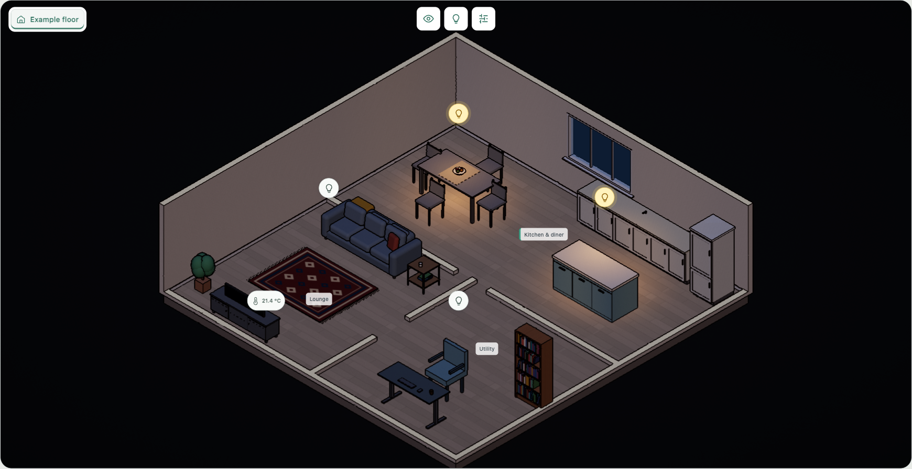

# Floorplan Card

A visual floorplan for your Home Assistant dashboard. Arrange rooms, furniture and controls in the editor, then connect your entities when you’re ready.

*Actual card rendering with a fictional home and simulated entities. Your own floorplan stays in your Home Assistant instance.*

- **Control your home:** toggle individual lights, rooms or groups; see temperature, heating and presence updates.
- **See it at a glance:** an illustrated cutaway of every floor from one fixed angle, with softly animated lamps and screens. Keep controls visible or reveal them on hover.
- **Set up visually:** place elements before linking entities, then export the complete layout and artwork to another installation. No YAML required.

## Install locally

1. Copy `dist/hacs-floorplan.js` to Home Assistant's `/config/www/hacs-floorplan.js`.
2. In **Settings → Dashboards → Resources**, add `/local/hacs-floorplan.js` as a **JavaScript module**. Advanced mode may be needed to show Resources.
3. Reload the browser, edit your dashboard, select **Add card**, and search for **Floorplan Card**.
4. Follow the visual editor and press Home Assistant's **Save** button when finished. No YAML configuration is required.

## Install through HACS

Add `https://github.com/ShiftySushi/hacs-floorplan` to HACS **Custom repositories** with type **Dashboard**. Install **Floorplan Card** and reload the browser. If HACS does not register the resource automatically, add `/hacsfiles/hacs-floorplan/hacs-floorplan.js` as a JavaScript module in Dashboard Resources.

The distribution filename matches the repository name. HACS offers the latest [release](https://github.com/ShiftySushi/hacs-floorplan/releases) and lists what changed in each; [CHANGELOG.md](CHANGELOG.md) holds the same notes. The GitHub distribution contains only plugin code and the fictional demo; personal floorplans are supplied locally through the editor.

## Guided setup

1. **Floors:** add storeys and choose floorplan images. PNG, JPEG and WebP use Home Assistant's authenticated image upload; small SVG files are embedded in the dashboard configuration. An existing `/local/` or HTTPS image URL is also supported. Rotate by 90° buttons or any angle from 0–359°. Set the full plan's width and depth in metres, including image margins, or mark two points and enter their known distance to calibrate the scale. **Align storeys in 3D** exposes floor elevation and horizontal offsets for matching building corners or stairwells.
2. **Rooms:** click the inside corners of a room in order and finish its polygon. Undo, cancel, redraw and coordinate controls are provided. Choose a floor material and colour, then search for and assign its lights and optional motion/occupancy/presence binary sensors. For 3D, trace each shared wall once, set its height and thickness, then add doors and windows. Opening positions and dimensions remain editable.
3. **Furniture:** choose **Unlock editing**, search the illustrated catalogue, choose an object and tap its location. Drag to move, or drag a selected corner to resize. The selected-object toolbar provides rotation, duplication and removal; right-click focuses these tools. The inspector provides exact dimensions and keyboard alternatives. Lock editing when finished. Optional 10, 25 or 50 cm snapping and keyboard controls help with precise placement. Sofa, piano and bed variants are available. Furniture is decorative and does not need a Home Assistant entity.
4. **Entities:** search for a light, sensor or binary sensor and tap its position. Select a marker to reposition it, or adjust its coordinates. Choose a generic, pendant or spot icon. An existing marker's **Assigned entity** selector replaces its binding while preserving the position and updating matching room/group assignments across floors. This is useful for binding an imported layout's placeholders to real devices. The editor can place assigned room lights automatically for you to fine-tune.
5. **Groups:** create named selections spanning rooms or floors. Choose the floor for new members; unpositioned lights receive individual markers that you can fine-tune in **Entities**.
6. **Review:** choose furniture visibility, room labels and drawing quality. Check the visual preview for each floor, then press Home Assistant's **Save** button. Reopen any section to make changes; **Undo** and **Redo** cover scene edits while the editor remains open.

The catalogue includes pianos, TVs and TV benches, side tables, display cabinets, bookshelves, sofas, beds, dining tables and chairs, toilets, sinks, baths, showers, desks, office chairs, kitchen units, islands, fridges, rugs, plants, stairs and floor lamps. Images provide a tracing reference; the card does not automatically infer walls or furniture from a photograph or drawing.

## The illustrated view

The card draws your home as a furnished cutaway seen from one fixed angle, looking from the south-east, in an evening light. The angle never changes, so walls, furniture and lighting are composed for it. This is a real-time stylised drawing, not a photorealistic architectural render. A floor that has only a traced image, with no rooms or walls yet, is shown as a flat 2D plan, as is any floor when WebGL is unavailable or interrupted.

With several floors, **All** shows the storeys stacked at their true heights, with stair flights passing through wells in the floor above. Because upper storeys hide the ones below, hover over the plan, or click, tap or press Enter or Space on it, to slide the storeys apart into a stepped row with each floor named; press Escape or activate it again to stack them. Choose a floor to see that storey alone. The navigation lists floors, then **External** (when configured), then **All**.

Walls are cut so nothing is hidden. Outside walls on the far side stand full height. Outside walls on the near side drop to a kerb. Walls between rooms stop at about one metre, and drop to a kerb where they would still hide the foot of furniture behind them. Radiators, pictures and wall cupboards are shown only where their wall is tall enough to carry them, and ceiling fittings are not drawn.

The standalone demo restores simulated device states, brightness, colours and the selected theme when refreshed. A loading screen stays visible until restoration and the initial view are ready. In Home Assistant, device states continue to come from Home Assistant.

Click a lamp in the drawing to toggle its group. A room-specific configured group takes priority; otherwise matching fittings in the room toggle together, keeping spots, pendants and accent lights separate. If any available member is on, the group turns off. Unavailable and unconnected lights are excluded. Lamps accept nearby taps without enlarging their models. Each light's marker button toggles that light alone and is reachable from the keyboard.

Each assigned light creates a local pool of illumination. Brightness controls its strength; RGB colour and white temperature tint its zone. Overlapping lights brighten more of the room, while unlit areas stay dim. Pools follow the placed markers and stop at room boundaries. Spots use a narrower footprint than pendants; lights without a marker use the room's centre. Lit lamps glow and shimmer gently. These are illustrative light footprints, rather than measured beam angles.

Room status shows **Lit** when any assigned light is on and **Dark** when all assigned lights are known to be off. Missing or unavailable lights produce **Lighting unknown** when none is known to be on. Presence is independent of lighting: any assigned binary sensor being `on` shows presence. Missing sensors produce **Presence unknown**, rather than a false empty-room indication. Room status is available as text as well as colour.

Tap a light, room or light group to turn its lights on or off immediately. A room or group with any available light on switches off; otherwise it switches on. Use its separate **Adjust** button, or enable **Select lights**, for brightness and colour. Selections persist across floor changes; turning selection mode off clears them. Sensor markers open Home Assistant's normal entity detail dialog.

Bind individual bulb entities when each bulb should have its own marker. Create card groups for combinations such as spots and pendants, while room controls cover all assigned room lights. Alternatively, bind a Home Assistant smart-group light entity to control that group as one light. Avoid placing both a smart group and its member bulbs in the same card group. The card sends commands to the entities you choose; Home Assistant handles any hardware grouping.

Furniture supports elevation above the floor, so TVs and monitors can sit on benches and desks. TV light strips and hexagonal wall panels can be linked to a light entity; their illumination follows power, brightness and colour. Computers and ultrawide monitors are available in the furniture catalogue. These bindings and elevations are preserved when exporting or rebinding a placed light.

Select a TV in the furniture editor and choose its **TV media player** entity to show animated decorative scenes when it is on. The screen goes dark when the TV is off; this connection is separate from its light strip. Scenes are generated locally, without streaming media, and use a still image when reduced motion is enabled. The picture also casts its shifting colour into the room.

Lamp and TV animation runs at about thirty frames per second, pauses when the view is hidden and holds still when reduced motion is requested. **Low** quality draws at single resolution; Automatic and High use up to double resolution.

Display settings offer **Hide light fixtures**, **Hide radiators** and **Hide extraction fans**; hiding a fixture keeps its illumination. **Hide cameras** hides room cameras, printer previews and exterior camera previews while retaining door-contact readings. These view preferences are saved in the current browser; shared defaults are available in the card editor.

Mathmos colour choices list the liquid first and wax second. Both appear in the bottle, and the lamp's spill light blends the two colours while following its light entity's power and brightness.

TVs and light strips offer matching 43–85 inch size presets, with 65 inch as the default. Ceiling lights sit at ceiling height by default, with an optional mounting height in the light editor.

In **Rooms**, choose a **Room temperature entity** to show its current temperature as a compact readout on the plan. Add radiators through **Furniture**, then choose each **Radiator heating entity** in its inspector. Each bound radiator has a marker showing whether it is heating; tap it to open its Home Assistant controls. Temperature and heating bindings are included in private scene exports.

Occupied rooms show a coloured edge on their readout. Temperatures below 18°C use a cool tint; above 24°C use a warm tint (Fahrenheit readings are converted for this comparison). Choose **Outdoor temperature entity** in **Floors** to show an outdoor reading to the left of the house. Missing readings are hidden.

Tap or click a room readout to open its status and controls; use **Close** or Escape to dismiss it. **Rooms → Room status, controls and energy** adds humidity beside temperature, PM2.5/VOC readings with configurable warning thresholds, switches, Sleep Mode, media players, scenes, vacuum actions and per-plug power/daily energy. Room readouts put temperature and humidity below the room name. A coloured edge indicates presence; the popup explains presence and air quality. Binary presence sensors cannot determine a person count or position. Unbound energy devices remain editable and totals label missing readings as partial. On narrow screens, collapse **At a glance** if it covers a room marker.

Hovering over a room does not open its popup. Live updates preserve panel scrolling and the expanded or collapsed state of **At a glance**. Room controls stay bound to the selected room, including when two rooms share a name. The popup shows a controls section only when lights or controls are assigned.

A room's **Room heating demand sensor** drives its radiators when no object demand override is set. This is a room-level heating proxy. Printer furniture accepts status, progress, time-left, bed-temperature, job and camera bindings: the printer's marker reports printing progress and shows a persistent warning on `error`. The room card groups these readings with the printer light display and shows the bound camera's live feed, falling back to its current snapshot when streaming is unavailable. Light markers have a minimum 44-pixel invisible target.

Furniture editing opens in neutral **2D edit**. Choose **3D preview** to see that floor in the illustrated view while editing dimensions in the inspector. Return to 2D to place or drag furniture.

The illustrated view follows your home as it changes. Lights fade between states over about half a second, and wall panels play their Breathe, Wave or Rainbow effect. An addressable strip shows how much of its length is lit. A radiator glows while it is heating, a door with a contact sensor stands open or shut with it, a printer's toolhead moves while it prints and its screen turns red on an error, and a presence sensor's status light comes on when it detects someone. A TV with `tv_scenes` shows those stills, five minutes each, instead of the generated films. A framed picture bound to a media player shows what is playing; click a frame that has a media player or a portrait image to turn it between landscape and portrait.

The view follows the time of day. In the evening it is a dim scene lit by your lamps; as the sun rises the rooms brighten, the lamps fade into the daylight and light falls through each outside window. Click a window blind to draw or open it: a drawn blind keeps the daylight out, and the choice is saved in the current browser. The sun's height comes from Home Assistant's Sun integration, with cloud cover from your weather entity.

Sloping ceilings and rooflights are drawn where they fall away from the viewer, as part of the backdrop; a slope that would cover the room is drawn see-through instead, and a rooflight lets daylight in like a window. Fitted wardrobe fronts follow their wall: full doors where the wall stands, and only their lower part where it is cut down.

Anything hung on a wall that the view cuts away, such as kitchen wall cupboards on the near side, is drawn as a faint ghost so it stays readable without hiding the room.

In the **All** view, rest the pointer on the drawing for a moment, click it, or press Enter to spread the storeys apart. Display settings offer **Ground floor on the left when spread**; without it the storeys take whichever order nests them most closely.

### Not yet in the illustrated view

Earlier versions offered 2D, orbiting 3D, Pokémon, Zelda and Sims-like live styles. Those are retired; a scene saved with any of them loads in the illustrated view. Their data is kept in your configuration, but the following are not drawn or animated yet:

- Follow mode and single-room isolation.
- Uploaded Pokémon or Zelda backgrounds and furniture sprites (`style_images`).
- Weather inside the rooms' views; rain, snow and cloud are drawn in the External view.

Furniture editing snaps placements and moves to a 10 cm grid by default. Drag an item from the catalogue onto the plan, or select it and tap its position. You can turn snapping off in the furniture inspector; that choice remains in effect while editing.

Search the furniture catalogue by product name for measured presets from Kawai, Oak Furnitureland, LG, IKEA, Secretlab and VASAGLE. Presets include assembled width, depth and height, suggested finish swatches and a dimensions source. KALLAX includes upright and sideways options; the LG G4 includes wall-mounted and freestanding versions. Adjustable desks start at 75 cm high. Dimensions and colours remain editable, and **Restore product dimensions** resets only the size. Product presets use their full physical bounds in 2D and 3D and are preserved in configuration exports. Calibrate the floor dimensions first; finish swatches and model details are illustrative.

Power works for all available selected lights. Brightness, RGB colour and white temperature appear only for compatible selections, with an eligible count shown. Colour is available for RGB, RGBW, RGBWW, HS and XY colour-capable lights, not plain dimmers or tunable-white-only lights. Temperature is clamped to each light's supported range. Mixed selections apply each setting only to compatible lights. Initial control values represent the first compatible light, not a group average.

## At a glance and exterior

**Floors → Outdoor weather** selects a Home Assistant weather entity and controls effect intensity. If left blank, it uses the At a glance weather entity, then an available weather integration. Rain, downpours, snow, sleet, hail, clouds, fog, wind and storms appear outside the building in the External view. Sunny and clear-night conditions use its daylight background. Precipitation avoids building footprints; effects pause with the page and respect reduced motion. These are visual weather effects, not a forecast or snow-accumulation simulation. The separate outdoor-temperature chip hides when At a glance already contains weather.

**Lights & sensors → Entity & room labels** creates movable labels for any Home Assistant entity domain. Add a title, associate a room, and combine up to 16 readings. Each row supports a custom name, an optional attribute and a unit override. Drag or enter coordinates to position the label; its height controls where it is anchored above the floor. Tap a live reading for Home Assistant's normal entity controls. Missing values say “Unavailable”. Labels travel with scene imports and exports.

The furniture catalogue includes **Hue Motion Sensor**, **Everything Presence Pro**, **Everything Presence One** and **Everything Presence Lite**. These are original procedural representations with editable dimensions. Assign presence entities, optionally select a room whose occupancy they report, and choose free placement, a wall/side/offset or a room top corner. Attached models follow geometry edits; detach with **Free placement** before dragging elsewhere. Top-corner placement sets height and points into the room. Model appearance references are in [CREDITS.md](CREDITS.md).

In **Review → At a glance**, choose a title, any corner, panel width (240–800 px), maximum height and compact or comfortable spacing. Arrange up to 48 items in one to four columns; move items up or down, duplicate them, or add section headings. Each item supports an icon, accent colour, column span, minimum height, value size, alignment and optional details. A chosen column span overrides full width. Narrow screens limit the layout to two columns and clamp wider items to fit. Live updates preserve scroll position. The panel stays visible when floorplan markers are hidden and can be collapsed.

**Entity** accepts any Home Assistant entity domain, including switches, locks, climate entities and sensors. Show its state or enter an attribute name, with optional units and decimal precision. Choose **Value**, **Gauge**, **History line** or **History bars**. Gauges use numeric readings with a configurable scale (0–100 by default). Charts have configurable height and scale limits, and show 1 hour, 6 hours, 24 hours or 7 days of recorded numeric history. Bars represent readings, not consumption totals. History uses the current Home Assistant connection, refreshes at most every five minutes and requires the selected entity or attribute to have recorded data. Missing readings leave gaps; empty, failed and stale history are labelled. Selecting the readout opens the entity's Home Assistant details. Use separate entity items and headings to build the grouping you want.

Calendar items merge the next seven days from selected calendars, sorted by start time with separate dates, titles and source names; feed URLs are omitted. The event limit is configurable. Events refresh through Home Assistant every five minutes while the card is visible; refresh failures retain available events and show a warning. **Plug energy** provides a configurable utility/network summary with separate device rows and explicit missing readings.

**Who’s at home**, **HA updates** and **Low batteries** summarise people, update entities and battery-class sensors. They use all matching entities by default, or an explicitly selected list. The low-battery threshold defaults to 20%; unavailable counts are shown by default for explicitly selected lists and can be toggled per item. Automatic summaries omit partial unavailable counts; wholly unavailable readings remain labelled. These readouts do not install updates or control devices. Panel and item settings are stored under `information` and included in scene imports and exports.

For a prepared low-battery summary, select **Battery count sensor** and **Battery names sensor**. These replace the device scan; the names sensor contains comma-separated names. An unavailable summary stays unavailable rather than falling back to a different count.

A scene with `exterior` data exposes an **External** button after the floor choices and before All. It shows the outside of the home from the same fixed angle, and in the same ink and light, as the rooms: it brightens through the day, and rain, snow, fog and cloud from your weather entity fall over the site. Choose a floor or **All** to go back inside. The exterior contains metre-based `box`, `surface`, `plant` and `car` items: boxes/plants/cars use `x`, `y`, `z`, `width`, `height`, `depth` and optional `rotation`/`colour`; surfaces use three or four `[x,y,z]` vertices. The root specifies `width_m`, `depth_m`, `height_m` and `items`. Exterior geometry is supplied through the scene configuration; the furniture editor does not edit it. Personal site geometry belongs only in a private scene, not the card bundle.

Exterior items can select a `finish` of `grass`, `asphalt`, `paving` or `brick`. These finishes use repeating procedural textures at metre scale; plants use textured leaf geometry. Imported meshes can be embedded in `exterior.models` and referenced by an item's `model` key. Model data and attribution stay in the portable scene; model credits are documented in [CREDITS.md](CREDITS.md). Rendering requires no external model or texture requests.

Exterior `light` items accept `light_entity` and follow its on/off state, brightness and colour. A `charger` item accepts `charging_entity` and optionally `connected_entity`; its cable is docked by default and extends along `plugged_cable` (an array of local `[x, y, z]` metre points) while charging or connected. Without a connected sensor, a paused charge appears docked. Unavailable states show an unlit fixture and a docked cable unless another supplied sensor confirms a connection.

**Floors → Exterior live bindings** connects vehicle location, charging, cameras and door contacts/locks. A bound car appears only when its tracker reports `home` and glows while charging. Set its `rotation` to keep it parked along the drive; this takes precedence over GPS heading, including when rotation is zero. Cars without an explicit rotation follow the tracker's numeric `heading` attribute. Camera thumbnails refresh about once a minute and open Home Assistant's camera details on tap. Bind door contacts/locks in the wall inspector to show their live state; bound doors follow the contact instead of a saved preview angle. Camera and other unavailable states are labelled explicitly.

Solid framed door openings can include `glazing: {width, height, sill}` in metres and a `transom_height` within the opening's total height. The glass remains transparent when the leaf is closed, and its area contributes to interior daylight. An optional `outside_lights` list models light entering through the opening from those HA lights. Exterior items support `glazing: true` for reflective panes, `light_style: spot` for a spotlight, and `type: doorbell` for a compact camera doorbell.

## Addressable strip displays

Select a **TV light strip** in the furniture inspector and assign its pattern, colour and fill sensors. `pattern_entity` enables the addressable renderer; `colour_entity` reads a six-digit hex colour and `fill_entity` reads 0–100. Existing strips without a pattern sensor retain their light/TV-sync behaviour.

- `off` (also an unknown or unavailable pattern): no emission.
- `center-dot`: an 8 cm glow centred within the full fixture width, ignoring fill percentage.
- `full-fill`: the entire configured width, regardless of the fill sensor.
- `progressive-fill`: the supplied percentage, clamped to 0–100; missing or invalid fill is dark.

Keep the full physical strip width. `fill_direction` can be `left-to-right` (default) or `right-to-left`, along the object's local width before rotation. Reverse it after comparing a partial fill with the physical plug end. A pattern sensor takes precedence over `light_entity`; the light binding remains optional for control and ambient illumination. Missing/invalid colour falls back to the light's colour or warm white.

## Floorplan assets

When importing a portable configuration into Home Assistant, wait for the import to finish before pressing **Save**. Embedded floor images and custom artwork are uploaded to Home Assistant’s image storage, and the dashboard stores their URLs instead of large base64 payloads. SVG and WebP artwork is converted to PNG for HA compatibility. Duplicate images are uploaded once per import. Failed uploads leave the previous card configuration unchanged. Exports still include the stored images so the configuration remains portable.

To replace an already populated card, open **Import / export → Replace current configuration** and choose **Import configuration JSON**. The file replaces all existing items and settings, clears unfinished editing tools and returns to **Floors**. Nothing is merged; **Undo** restores the entire previous configuration. There is no need to delete or recreate the card.

In the card editor, choose **Floors → Choose floorplan image**, then select a local outline. The image is uploaded to your Home Assistant instance or, for a small SVG, stored directly in your dashboard configuration. There is no need to upload it to GitHub, put it in the plugin directory, or edit YAML. Plugin updates leave those personal assets separate from the installed code.

In **Entities → Add element**, place lights, temperature and presence markers before connecting Home Assistant. Give each element a name and room, and drag it to position it (10 cm snapping). Unconnected lights can already belong to room and group selections. Later, choose **Assigned entity**: the position, name and room/group references are preserved. Unconnected elements are labelled **Not connected** and cannot send commands. They are included in full configuration exports.

Use **Import / export → Export full configuration** to save the layout with all floors, embedded images, rooms, walls, furniture, lighting and sensor assignments, heating bindings, groups and appearance settings in one JSON file. Images must be accessible to the browser; export refuses unreadable images rather than leaving broken local references. On production, install the same or a newer card version and use **Import configuration JSON** in the same editor section. Review the destination entity IDs and save in Home Assistant. This transfers one complete card configuration; it does not transfer Home Assistant integrations, credentials or live entity states. Nothing needs to be committed to Git. Import replaces the card's scene and can be undone. Keep exported files private: they contain your home layout and entity IDs. Portable exports are limited to 32 MB, with fetched images limited to 8 MB each.

The public demo uses a fictional layout and contains no traced personal room boundaries or dimensions.

## Development

Build, preview, bundle budget, private assets and publication checks are covered in [PROJECT.md](PROJECT.md). Contributor commands and the delivery workflow are in [AGENTS.md](AGENTS.md).

## References

The [Spatial Lights Card](https://github.com/Mihonarium/hass-spatial-lights-card) is the interaction reference supplied for this project. This implementation is independent and does not import its source.

Live Home Assistant installation, authenticated image upload, HACS delivery and physical-device behaviour still require integration verification.
